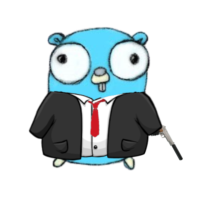

# gopher47
> A 3rd party implant for the [Havoc](https://github.com/HavocFramework/Havoc) Framework

    

it's like the videogame :D

## What is This? 🤔
This is a 3rd Party agent for the Havoc C2 written in Golang, mainly written as a learning project, but I'm sure it's still useful.

By the time this is out, you can read more about what and why this is at my blog: [here](https://notateamserver.xyz)

**Contributions welcome!** I don't plan on updating this all too regularly, but if I have fun making it I might add more stuff over time.

## Commands

| Command | Description                                     | Example            |
|---------|-------------------------------------------------|--------------------|
| `o7`    | The gopher dies :(                              | o7                 |
| `shell` | Run a command (executed through Go's `os/exec`) | shell netstat -ano |

## Usage
Once you have your teamserver up, it's as simple as running the following:
- **Attacking Machine**: `python handler.py`
- **Target Machine**: `./gopher47`

You can use the Havoc GUI to compile it, or you can just edit the source code as you please and play with the Makefile, there isn't that much of it.

## FAQ

### Why Go?
I just wanted to have an actual Golang project put together that I can [point to](https://i.kym-cdn.com/entries/icons/original/000/035/627/cover2.jpg).

### Will it evade AV/EDR?
idk, but grow up. Obfuscate and customize it yourself, stop being a baby.

### How's your day going?
I photoshopped a gun into the Golang gopher's hand for this at 1:00 AM, and my Winter break is over tomorrow.

